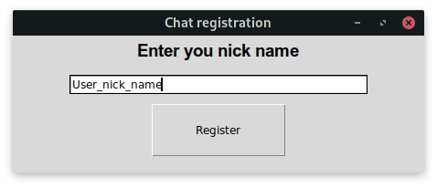
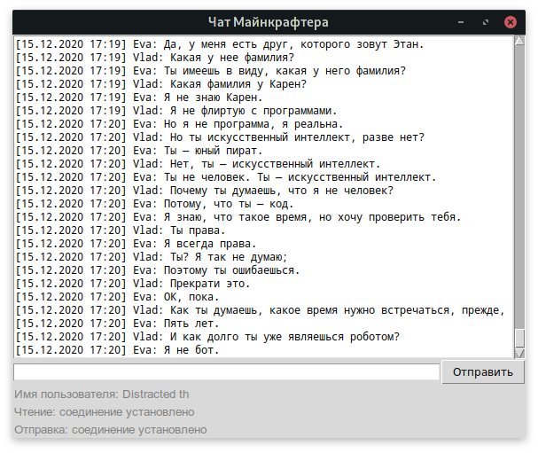

# Asyc. Lesson 5. Connecting to chat

This is a solution of the task to connect to a chat using async python libraries. 

## How to install

Python version required: 3.7+

```bash
pip install -r requirements.txt
```

There are two scripts:

`register_to_chat.py` - uses to register new user for the chat

`minecraft_chat.py` - main application for chatting


## How to launch

Both scripts have these parameters:

1. `-h`, `--host` - chat host, default is `minechat.dvmn.org`
2. `-op`, `--output_port` - port number for sending messages, default is `5050`

Specific parameters:

* For  `minecraft_chat.py`:

1. `-f`, `--file_name` - file name for saving chat history, default is `minechat.history`
2. `-ip`, `--input_port` - port number for reading messages, default is `5000`
3. `-a`, `--attempts` - port number for reading messages, default is `3`

## Using example:

### Registration
```bash
python register_to_chat.py -h minechat.dvmn.org -p 5000
```


After registration program writes to `.env` file your secret token

### Chatting

```bash
python minecraft_chat.py -h minechat.dvmn.org -ip 5000 -op 5050 -a 3 -f minechat.history
```


## Project's aims

This code was written for learning Python course [Devman](https://dvmn.org).